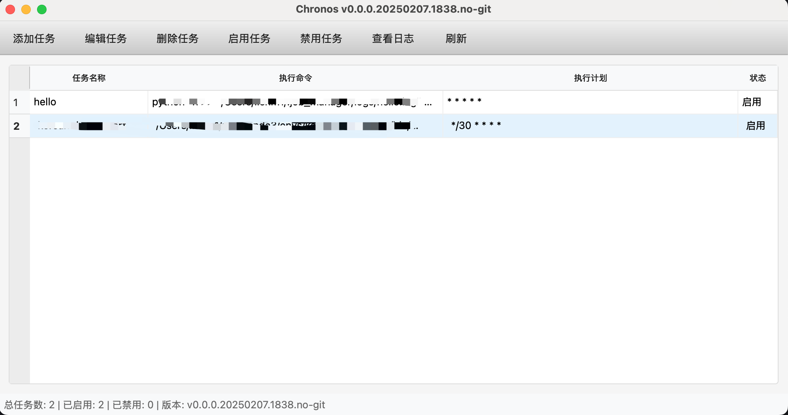
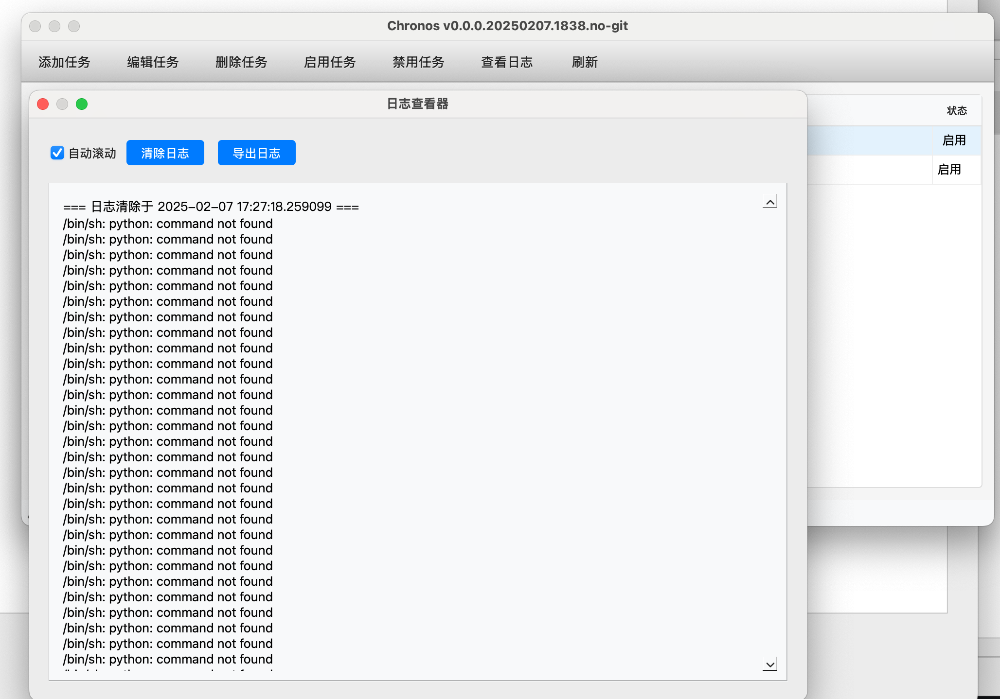

# Chronos 

[](LICENSE)
[](https://www.python.org/)
[](https://www.riverbankcomputing.com/software/pyqt/)

一个基于PyQt6开发的图形化定时任务管理工具，支持cron表达式，可以方便地管理和监控Linux/Unix系统的定时任务。

## ✨ 主要特性

- 📝 图形化界面管理crontab任务
- 🔄 支持完整的cron表达式
- 📊 实时显示任务状态和统计信息
- 📋 支持任务的增删改查操作
- 🔍 内置日志查看器
- 🔔 系统托盘支持，最小化后继续运行
- 🎯 支持任务的启用/禁用功能

## 🚀 快速开始
### 系统要求

- Python 3.6 或更高版本
- Linux/Unix 操作系统（支持crontab）

### 安装步骤

1. 克隆或下载本项目到本地
```bash
git clone https://github.com/konbluesky/chronos.git
cd chronos
```

2. 安装依赖包
```bash
pip install -r requirements.txt
```

### 启动程序

1. 在项目目录下运行以下命令：
```bash
python main.py
```

2. 程序启动后会在系统托盘显示图标，可以通过以下方式操作：
   - 左键单击托盘图标：显示主窗口
   - 右键单击托盘图标：显示快捷菜单

### 基本使用

1. 添加任务
   - 点击工具栏的"添加任务"按钮或使用快捷键 Ctrl+N
   - 填写任务名称、执行命令和执行计划
   - 点击确定保存任务

2. 管理任务
   - 编辑任务：选中任务后点击"编辑任务"或使用快捷键 Ctrl+E
   - 删除任务：选中任务后点击"删除任务"或使用 Delete 键
   - 启用/禁用任务：选中任务后点击"启用/禁用任务"或使用快捷键 Ctrl+T

3. 查看日志
   - 选中任务后点击"查看日志"或使用快捷键 Ctrl+L
   - 日志窗口会实时更新显示任务的执行记录

### 常见问题

1. 权限问题
   - 如果遇到"Operation not permitted

## 💡 使用说明
### 添加任务

1. 点击工具栏的"添加任务"按钮或使用快捷键 `Ctrl+N`
2. 在弹出的对话框中填写：
   - 任务名称
   - 执行命令
   - 执行计划（cron表达式）
3. 点击确定保存

## 👥 作者

- konbluesky - [@konbluesky](https://github.com/konbluesky)

## 📸 界面展示

### 主界面


### 添加任务


### 日志查看


## 🙏 致谢

- [python-crontab](https://pypi.org/project/python-crontab/)
- [PyQt6](https://www.riverbankcomputing.com/software/pyqt/)